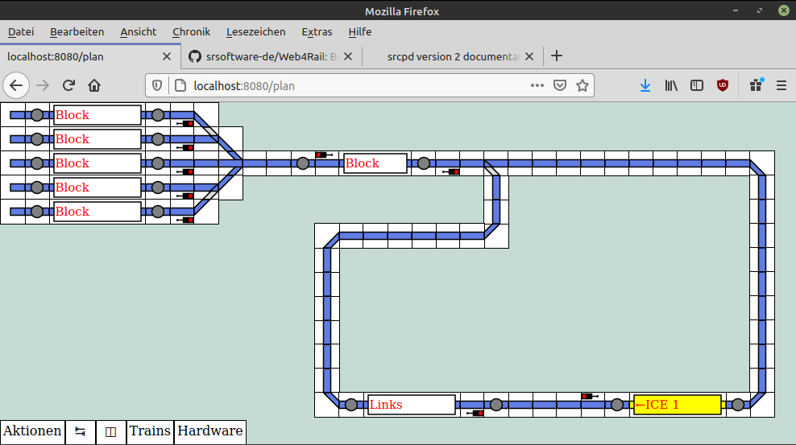
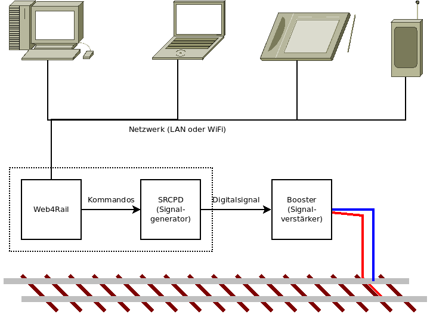

[[Deutsche Version](README.md)]

## Was ist Web4Rail?

Web4Rail is a model railway control software.
It is designed to be used from any device featuring a web browser.

It is a client-server application. In other words

* The program itself is running on a central computer, connected to your digital model 
  railway layout.
* In order to let a user interact with the railway, an arbitrary web-enabled device (PC, Laptop, Tablet, Smartphone, TV, ...) can 
  connect to the central computer and take control.
* Thus, it is even possible to let several users and devices control the layout simultaneously!

## Digital control of the layout

The control signal for the layout is generated using [SRCPD] – this program *may* also 
be running on the same hardware as the Web4Rail program.

[SRCPD]: http://srcpd.sourceforge.net/srcpd/index.html

## State of development

This program is currently under development.
