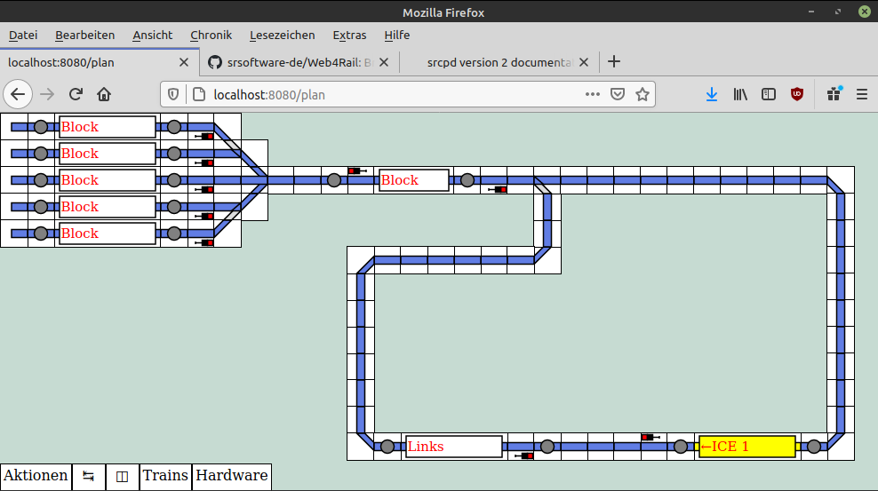
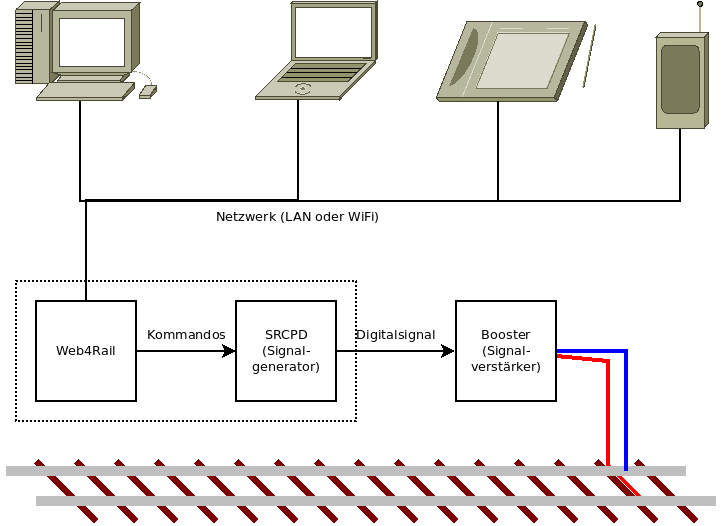

[[English version](README.en.md)]

## Was ist Web4Rail?

Web4Rail ist eine Modellbahn-Steuerungssoftware, welche dafür zugeschnitten ist in einem Web-Browser ausgeführt zu werden.

Es ist eine Client-Server-Anwendung. Das bedeutet:

* Die Anwendung wird zentral auf einem Computer ausgeführt, welcher an die digitale Modellbahn angeschlossen ist.
* Zu Steuerung durch den Nutzer kann ein beliebiges internetfähiges Gerät (Desktop-PC, Laptop, Tablet, Smartphone, TV, ...) sich mit diesem Computer verbinden und die Kontrolle übernehmen
* Es können auch mehrere Geräte/Personen gleichzeitig auf die Steuerung der Modellbahn zugreifen – damit ist ein Mehrbenutzer-Betrieb möglich

## Ansteuerung der Modellbahn

Das Signal für die Modellbahn wird mittels [SRCPD] erzeugt – dieses Programm *kann* ebenso auf dem zentralen Steuerungs-PC laufen, es kann aber auch auf einem separaten Computer installiert sein:

[SRCPD]: http://srcpd.sourceforge.net/srcpd/index.html

## Entwicklungsstand

Das Programm befindet sich derzeit noch in der Entwicklung.

## Links

* [Website](https://srsoftware.de/web4rail)
* [Github](https://github.com/srsoftware-de/Web4Rail)
* [Youtube-Kanal](https://www.youtube.com/playlist?list=PL8rWmE3MFXnXHPJzXLqMuBU732eJApfL8)